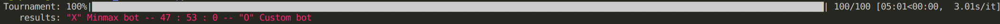
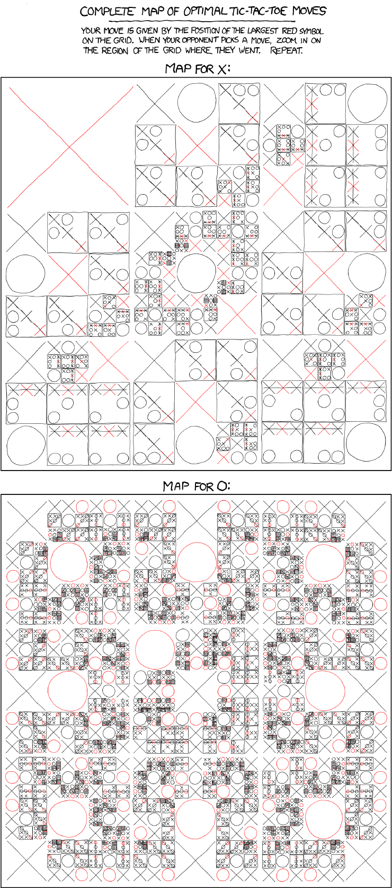

### TicTacToe playrground
-------
**TicTacToe** is deterministic game with possible 19683 sates. This simple implementation is purposed for crash-testing algorithmic agents ideas, mainly based on heurustic search. *#Realized as UŁ WMiI project for AI course.*

##### #**QUICKTOUR**:

For gameplay type `python tictactoe -x {player} -o {player}` where `player` denotes one of possible modes: `human`, `custom`, `minmax` , `debuts`, `random`. When `human` mode is applied 1-9 num-keys serve as interface (lookup `--help` for more info). To trigger tournament just specifie `-n` of duels, for example `python tictactoe -x minmax -o custom -n 100` reuslt wtih:

##### #**TOURNAMENTS**: 
  <pre>
  time       X-player      win  draw  loss    O-player
  (-5:22) &#8594;  Minmax bot --   0 : 100 :   0 -- Minmax bot
  (-5:01) &#8594;  Minmax bot --   5 :  95 :   0 -- Custom bot
  (-4:29) &#8594;  Minmax bot --  95 :   5 :   0 -- Random bot
  (-4:32) &#8594;  Minmax bot --  23 :  77 :   0 -- Debuts bot
  (-5:25) &#8594;  Custom bot --   0 : 100 :  00 -- Minmax bot
  (-1:02) &#8594;  Random bot --   0 :  28 :  72 -- Minmax bot
  (-1:02) &#8594;  Debuts bot --   0 :  99 :   1 -- Minmax bot</pre>

##### #**GAMEPLAYS**:

[*source XKCD*](https://xkcd.com/832/)
